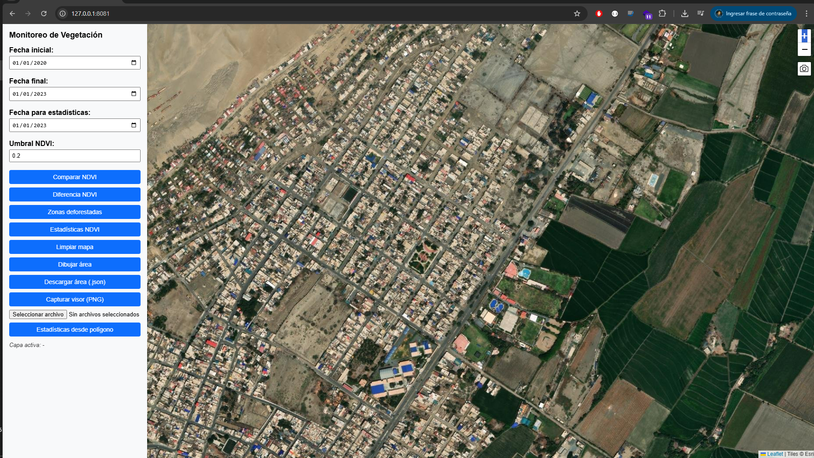

# 🌱 Visor de Deforestación con NDVI (LANDSAT + GEE)

Herramienta interactiva para visualizar y analizar la deforestación en áreas geográficas específicas mediante el índice de vegetación NDVI (Normalized Difference Vegetation Index). Utiliza datos de satélite proporcionados por **Google Earth Engine** (LANDSAT/LC08/C02/T1_L2) y está compuesto por:

- 🛰️ **Backend en Python + Flask** que expone una API para obtener imágenes NDVI y zonas de deforestación.
- 🗺️ **Frontend en HTML + Leaflet** que permite visualizar los datos de manera interactiva en un mapa.

---

## 📦 Estructura del Proyecto

```
.
├── backend/           # API con conexión a Google Earth Engine
├── frontend/          # Interfaz web con Leaflet
└── README.md          # Este archivo
```

---

## 🚀 Requisitos

- Python 3.8+ (para el backend)
- Node.js (opcional para `http-server`)
- Cuenta activa en Google Earth Engine
- Conexión a internet para cargar tiles y APIs

---

## ▶️ Ejecución local

### Backend

```bash
cd backend
python3 -m venv venv
source venv/bin/activate
pip install -r requirements.txt
earthengine authenticate
python app.py
```

### Frontend

```bash
cd frontend
http-server -p 8081
```

Abre tu navegador en `http://localhost:8081`.

---

## 🧠 Funcionalidades

- Visualización del NDVI de una fecha específica
- Comparación temporal de NDVI
- Detección de zonas deforestadas (con visualización en GeoJSON)
- Herramientas interactivas: dibujo, limpieza y descarga del área


